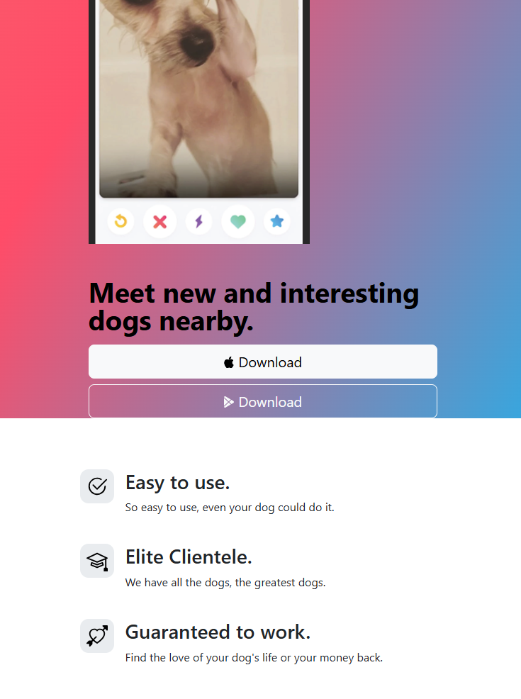

# tindog-bootstrapexample
### Sample mobile application ad page developed using only HTML, CSS and Bootstrap.

---

I used bootstrap snippets for the web page. I wanted to ensure that it was compatible with different widths and thus I wanted to obtain an image compatible with both mobile devices and computers.
Below is the view for different sizes:

  
Desktop

  

Laptop

  

Mobile

  

---

I used Bootstrap Examples for the web page. I revised the colors and structure. Below is an example:

  

